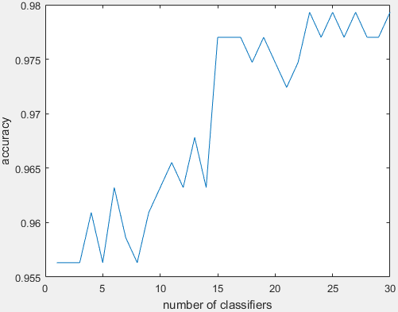

# Adaboost with Decision Stump

This a demo program that implements Adaboost method with decision stump week classifiers.

The main entrance for the demo program is DSdemo.m.

Decision stump : https://en.wikipedia.org/wiki/Decision_stump

Adaboost ensemble : https://en.wikipedia.org/wiki/AdaBoost

The single decision stump only achieves 95.632% accuracy.

2019-11-18
